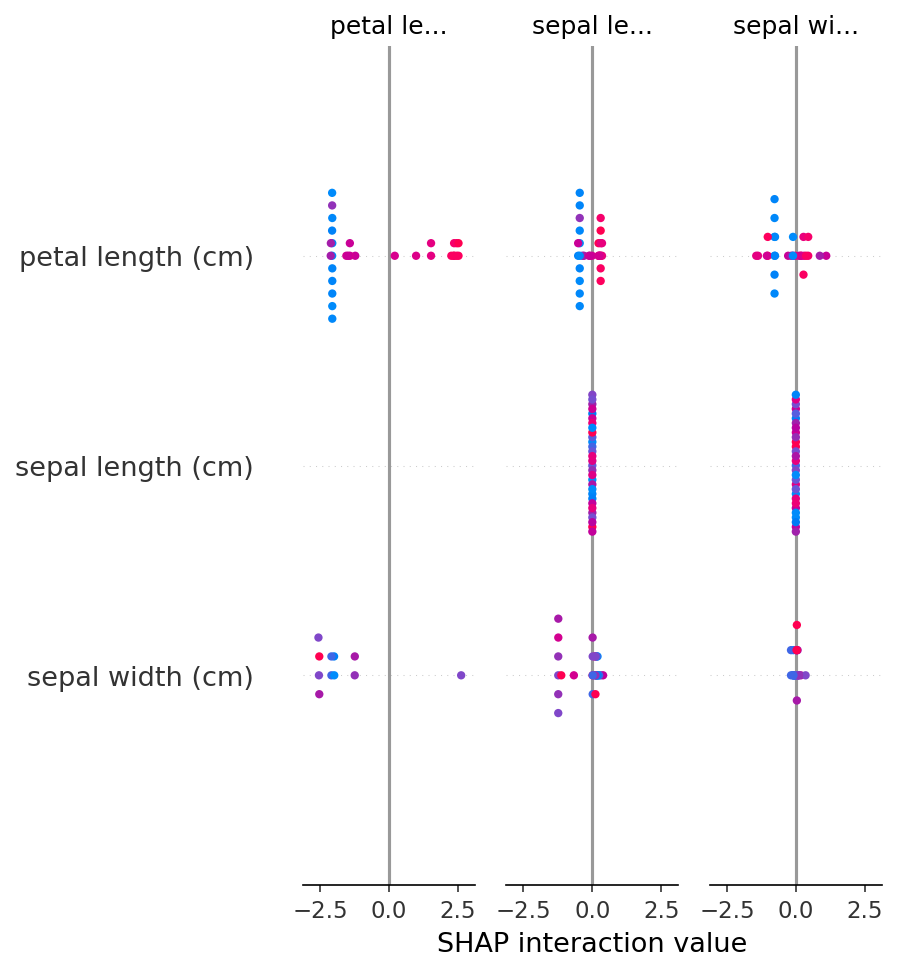

# 🤖 AI/ML Paper Implementations

AI/ML 핵심 개념과 논문 구현을 위한 학습 저장소입니다.

## 📚 목차

1. [BERT & Attention 데모](#bert--attention-데모)
2. [ML Ensemble & SHAP 데모](#ml-ensemble--shap-데모)

---

## BERT & Attention 데모

### 📄 파일: `bert_attention_demo.py`

이 스크립트는 두 가지 핵심 NLP 개념을 시연합니다:

### 1️⃣ BERT Tokenization (Pre-training)

BERT는 문장을 토큰으로 분리하고 각 토큰에 고유 ID를 부여합니다.

```python
from transformers import BertTokenizer

tokenizer = BertTokenizer.from_pretrained('bert-base-uncased')
text = "Machine learning is powerful."
inputs = tokenizer(text, return_tensors="pt")
```

**출력 예시:**
```
입력 문장: Machine learning is powerful.
토큰 ID: tensor([[ 101, 3698, 4083, 2003, 3928, 1012, 102]])
```

| 토큰 ID | 의미 |
|---------|------|
| 101 | [CLS] - 문장 시작 |
| 3698 | "machine" |
| 4083 | "learning" |
| 2003 | "is" |
| 3928 | "powerful" |
| 1012 | "." |
| 102 | [SEP] - 문장 끝 |

### 2️⃣ Simple Attention (Attention Is All You Need)

"Attention Is All You Need" 논문의 핵심 메커니즘을 단순화한 구현입니다.

```python
def simple_attention(q, k, v):
    scores = torch.matmul(q, k.transpose(-2, -1))
    weights = torch.nn.functional.softmax(scores, dim=-1)
    return torch.matmul(weights, v), weights
```

**Attention 수식:**
```
Attention(Q, K, V) = softmax(Q × K^T) × V
```

**출력 예시 (3개 단어 간 집중도):**
```
[[[0.9999  0.0000  0.0001]
  [0.0000  1.0000  0.0000]
  [0.0000  0.0000  1.0000]]]
```

각 단어가 다른 단어에 얼마나 "집중(attention)"하는지를 나타내는 가중치 행렬입니다.

---

## ML Ensemble & SHAP 데모

### 📄 파일: `ml_ensemble_shap_demo.py`

이 스크립트는 앙상블 기법과 모델 해석 가능성(XAI)을 시연합니다.

### 1️⃣ Random Forest (Ensemble Learning)

여러 개의 결정 트리를 조합하여 과적합을 방지하고 일반화 성능을 높입니다.

```python
from sklearn.ensemble import RandomForestClassifier

rf_model = RandomForestClassifier(n_estimators=100, random_state=42)
rf_model.fit(X_train, y_train)
```

**Feature Importance 결과:**
```
petal length (cm): 0.4400  ████████████████████
petal width (cm):  0.4215  ███████████████████
sepal length (cm): 0.1081  ████
sepal width (cm):  0.0304  █
```

### 2️⃣ XGBoost (Gradient Boosting)

이전 트리의 오차를 보완하며 순차적으로 학습하는 부스팅 기법입니다.

```python
import xgboost as xgb

xgb_model = xgb.XGBClassifier(n_estimators=100, learning_rate=0.1)
xgb_model.fit(X_train, y_train)
```

### 3️⃣ SHAP (SHapley Additive exPlanations)

각 특징이 예측에 얼마나 기여했는지 설명하는 XAI 기법입니다.

```python
import shap

explainer = shap.TreeExplainer(xgb_model)
shap_values = explainer.shap_values(X_test)
shap.summary_plot(shap_values, X_test)
```

**SHAP Feature Importance:**
```
petal length (cm): 2.0761  #########################################
petal width (cm):  0.5093  ##########
sepal length (cm): 0.1249  ##
sepal width (cm):  0.1213  ##
```

### 📊 SHAP Summary Plot



**모델 성능:**
| 모델 | 정확도 |
|------|--------|
| Random Forest | 100.0% |
| XGBoost | 100.0% |

---

## 🛠️ 설치 및 실행

### 필수 패키지 설치
```bash
# BERT & Attention 데모
pip install torch transformers

# ML Ensemble & SHAP 데모
pip install numpy pandas scikit-learn xgboost shap matplotlib
```

### 실행
```bash
# BERT Tokenization & Attention
python bert_attention_demo.py

# ML Ensemble & SHAP
python ml_ensemble_shap_demo.py
```

---

## 📖 참고 논문

1. **BERT**: [BERT: Pre-training of Deep Bidirectional Transformers for Language Understanding](https://arxiv.org/abs/1810.04805) (Devlin et al., 2018)
2. **Transformer**: [Attention Is All You Need](https://arxiv.org/abs/1706.03762) (Vaswani et al., 2017)
3. **Random Forest**: [Random Forests](https://link.springer.com/article/10.1023/A:1010933404324) (Breiman, 2001)
4. **XGBoost**: [XGBoost: A Scalable Tree Boosting System](https://arxiv.org/abs/1603.02754) (Chen & Guestrin, 2016)
5. **SHAP**: [A Unified Approach to Interpreting Model Predictions](https://arxiv.org/abs/1705.07874) (Lundberg & Lee, 2017)

---

## 📅 업데이트 로그

- **2026-01-19**: ML Ensemble & SHAP 데모 추가
- **2026-01-19**: BERT Tokenization & Simple Attention 데모 추가

---

## 📜 License

MIT License
